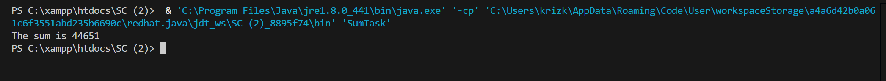
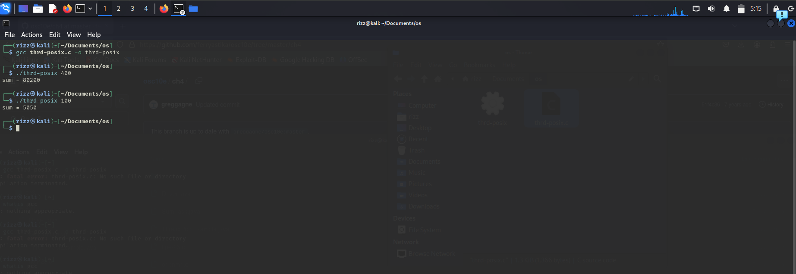

# Nama : Muhammad Rizqi Putra Nugroho
# NRP : 3124500044
# Kelas : 1 D3 IT B

## Programming Exercise 
### Nomor 1
```
/**
 * Fork/join parallelism in Java
 *
 * Figure 4.18
 *
 * @author Gagne, Galvin, Silberschatz
 * Operating System Concepts  - Tenth Edition
 * Copyright John Wiley & Sons - 2018
 */

import java.util.concurrent.*;

public class SumTask extends RecursiveTask<Integer>
{
    static final int SIZE = 10000;
    static final int THRESHOLD = 1000;

    private int begin;
    private int end;
    private int[] array;

    public SumTask(int begin, int end, int[] array) {
        this.begin = begin;
        this.end = end;
        this.array = array;
    }

    protected Integer compute() {
        if (end - begin < THRESHOLD) {
            // conquer stage 
            int sum = 0;
            for (int i = begin; i <= end; i++)
                sum += array[i];

            return sum;
        }
        else {
            // divide stage 
            int mid = begin + (end - begin) / 2;
            
            SumTask leftTask = new SumTask(begin, mid, array);
            SumTask rightTask = new SumTask(mid + 1, end, array);

            leftTask.fork();
            rightTask.fork();

            return rightTask.join() + leftTask.join();
        }
    }

	public static void main(String[] args) {
		ForkJoinPool pool = new ForkJoinPool();
		int[] array = new int[SIZE];

		// create SIZE random integers between 0 and 9
		java.util.Random rand = new java.util.Random();

		for (int i = 0; i < SIZE; i++) {
			array[i] = rand.nextInt(10);
		}		
		
		// use fork-join parallelism to sum the array
		SumTask task = new SumTask(0, SIZE-1, array);

		int sum = pool.invoke(task);

		System.out.println("The sum is " + sum);
	}
}


```

---

## Penerapan Thread pada Contoh Kode `SumTask` (Java Fork/Join)

Contoh kode `SumTask` tersebut menerapkan threading (utas) menggunakan **Java Fork/Join Framework**. Ini adalah kerangka kerja khusus yang dirancang untuk menangani tugas-tugas komputasi yang dapat dipecah menjadi sub-tugas yang lebih kecil secara rekursif (menggunakan pendekatan *divide and conquer*), dijalankan secara paralel, dan kemudian hasilnya digabungkan kembali.

Berikut adalah penjelasan penerapan thread pada contoh tersebut:

1.  **`ForkJoinPool`**:
    * Di metode `main`, `ForkJoinPool pool = new ForkJoinPool();` membuat sebuah *thread pool* khusus. Pool ini berisi sekumpulan *worker threads* yang siap menjalankan tugas-tugas Fork/Join. Jumlah thread biasanya disesuaikan dengan jumlah inti prosesor yang tersedia untuk memaksimalkan paralelisme.
    * Pool ini yang secara aktif mengelola eksekusi tugas pada thread-thread yang tersedia, seringkali menggunakan algoritma *work-stealing* agar thread yang menganggur bisa "mencuri" pekerjaan dari thread yang sibuk.

2.  **`RecursiveTask<Integer>`**:
    * Kelas `SumTask` mewarisi `RecursiveTask<Integer>`, menandakan ini adalah sebuah tugas yang dapat dipecah secara rekursif dan akan mengembalikan hasil berupa `Integer` (yaitu jumlah total).

3.  **Metode `compute()`**: Di sinilah logika pemecahan dan pengeksekusian tugas terjadi:
    * **Basis Rekursif (Tahap *Conquer*)**: Jika ukuran bagian array yang harus dijumlahkan (`length`) lebih kecil dari `THRESHOLD`, tugas tersebut cukup kecil untuk dikerjakan secara langsung (sekuensial) oleh thread yang sedang menjalankannya. Tidak ada thread baru atau pemecahan lebih lanjut yang dibuat di sini.
    * **Tahap *Divide***: Jika ukuran bagian array masih besar, tugas dibagi menjadi dua sub-tugas yang lebih kecil (`leftTask` dan `rightTask`), masing-masing bertanggung jawab atas separuh bagian array.
    * **`fork()`**: Panggilan `leftTask.fork();` dan `rightTask.fork();` adalah inti dari penerapan thread paralel di sini. Metode `fork()` **mengajukan (submit)** sub-tugas tersebut ke `ForkJoinPool` untuk dieksekusi secara **asinkron**. Artinya, thread saat ini tidak menunggu sub-tugas selesai, melainkan pool akan menjadwalkan sub-tugas ini untuk dijalankan oleh *worker thread* lain yang mungkin tersedia (atau oleh thread saat ini jika tidak ada thread lain yang bebas). Ini memungkinkan kedua sub-tugas (`leftTask` dan `rightTask`) berpotensi berjalan **secara paralel** pada inti prosesor yang berbeda.
    * **`join()`**: Setelah kedua sub-tugas di-*fork*, thread saat ini akan memanggil `rightTask.join()` dan `leftTask.join()`. Metode `join()` **menunggu** hingga sub-tugas yang bersangkutan selesai dieksekusi oleh thread mana pun di dalam pool dan kemudian **mengembalikan hasil** perhitungannya.
    * **Tahap *Combine***: Hasil dari kedua sub-tugas yang sudah selesai (`join()`) kemudian digabungkan (`+`) untuk mendapatkan hasil dari tugas saat ini.

4.  **Eksekusi Awal**:
    * `pool.invoke(task);` di metode `main` memulai keseluruhan proses dengan mengirimkan tugas awal (`SumTask` untuk seluruh array) ke `ForkJoinPool` dan menunggu hingga hasil akhir (total jumlah keseluruhan array) tersedia.

**Kesimpulan:**

Penerapan thread dalam contoh ini **implisit** dikelola oleh `ForkJoinPool`. Pemrogram tidak secara manual membuat atau mengelola `Thread` individual. Sebaliknya, pemrogram mendefinisikan bagaimana tugas besar dapat dipecah (`fork`) menjadi sub-tugas yang lebih kecil dan bagaimana hasilnya digabungkan (`join`). `ForkJoinPool` kemudian secara efisien menjalankan sub-tugas ini menggunakan *worker threads*-nya, memanfaatkan paralelisme pada sistem multi-core.



### Nmmor 2
### A. Penerapan Thread di Linux (thrd-posix.c)

```
/**
 * A pthread program illustrating how to
 * create a simple thread and some of the pthread API
 * This program implements the summation function where
 * the summation operation is run as a separate thread.
 *
 * Most Unix/Linux/OS X users
 * gcc thrd.c -lpthread
 *
 * Figure 4.11
 *
 * @author Gagne, Galvin, Silberschatz
 * Operating System Concepts  - Tenth Edition
 * Copyright John Wiley & Sons - 2018
 */

#include <pthread.h>
#include <stdio.h>
#include <stdlib.h>

int sum; /* this data is shared by the thread(s) */

void *runner(void *param); /* the thread */

int main(int argc, char *argv[])
{
pthread_t tid; /* the thread identifier */
pthread_attr_t attr; /* set of attributes for the thread */

if (argc != 2) {
	fprintf(stderr,"usage: a.out <integer value>\n");
	/*exit(1);*/
	return -1;
}

if (atoi(argv[1]) < 0) {
	fprintf(stderr,"Argument %d must be non-negative\n",atoi(argv[1]));
	/*exit(1);*/
	return -1;
}

/* get the default attributes */
pthread_attr_init(&attr);

/* create the thread */
pthread_create(&tid,&attr,runner,argv[1]);

/* now wait for the thread to exit */
pthread_join(tid,NULL);

printf("sum = %d\n",sum);
}

/**
 * The thread will begin control in this function
 */
void *runner(void *param) 
{
int i, upper = atoi(param);
sum = 0;

	if (upper > 0) {
		for (i = 1; i <= upper; i++)
			sum += i;
	}

	pthread_exit(0);
}
```

Penerapan thread dalam kode C (`thrd.c`) ini menggunakan pustaka **POSIX Threads (pthreads)**, yang merupakan standar de facto untuk threading pada sistem operasi mirip Unix, termasuk Linux. Program ini mendemonstrasikan pembuatan thread dasar: thread utama (yang mengeksekusi fungsi `main`) membuat satu thread pekerja tambahan. Fungsi `runner` didefinisikan sebagai titik masuk untuk thread pekerja ini; tugasnya adalah menghitung jumlah total bilangan bulat dari 1 hingga angka (`upper`) yang diterima sebagai parameter. Angka ini awalnya berasal dari argumen baris perintah (`argv[1]`) dan dilewatkan saat pembuatan thread. Komunikasi hasil antara thread pekerja dan thread utama dilakukan melalui variabel global `sum`, yang merupakan data bersama (*shared data*). Di dalam `main`, fungsi `pthread_create()` menjadi kunci pembuatan thread baru; fungsi ini menerima ID thread (`tid`), atribut thread (`attr` yang diinisialisasi ke default dengan `pthread_attr_init()`), pointer ke fungsi yang akan dijalankan thread (`runner`), dan argumen untuk fungsi tersebut (`argv[1]`). Setelah thread pekerja dibuat dan mulai berjalan, thread utama segera memanggil `pthread_join(tid, NULL)`. Panggilan ini bersifat *blocking*, artinya thread utama akan berhenti sejenak dan menunggu sampai thread pekerja (yang diidentifikasi oleh `tid`) selesai menjalankan tugasnya dan keluar (menggunakan `pthread_exit(0)` di dalam `runner`). Setelah `pthread_join()` kembali (menandakan thread pekerja telah selesai), thread utama dapat dengan aman mengakses nilai akhir dalam variabel global `sum` dan mencetaknya ke layar. Ini adalah pola umum dalam pemrograman multithread: mendelegasikan tugas ke thread lain, menunggu penyelesaiannya, dan kemudian menggunakan hasilnya.

<b>Berikut adalah Hasilnya :</b>

