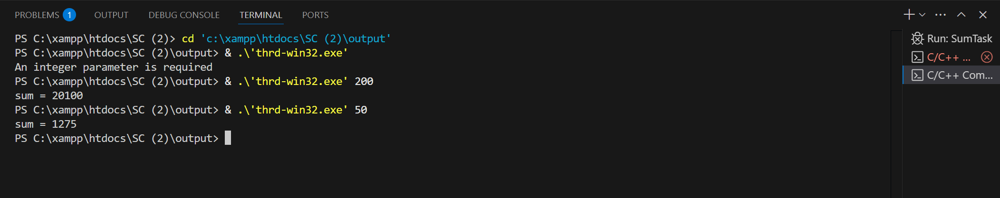

# Nama : Muhammad Rizqi Putra Nugroho
# NRP : 3124500044
# Kelas : 1 D3 IT B

## Programming Exercise 
### Nomor 1
```
/**
 * Fork/join parallelism in Java
 *
 * Figure 4.18
 *
 * @author Gagne, Galvin, Silberschatz
 * Operating System Concepts  - Tenth Edition
 * Copyright John Wiley & Sons - 2018
 */

import java.util.concurrent.*;

public class SumTask extends RecursiveTask<Integer>
{
    static final int SIZE = 10000;
    static final int THRESHOLD = 1000;

    private int begin;
    private int end;
    private int[] array;

    public SumTask(int begin, int end, int[] array) {
        this.begin = begin;
        this.end = end;
        this.array = array;
    }

    protected Integer compute() {
        if (end - begin < THRESHOLD) {
            // conquer stage 
            int sum = 0;
            for (int i = begin; i <= end; i++)
                sum += array[i];

            return sum;
        }
        else {
            // divide stage 
            int mid = begin + (end - begin) / 2;
            
            SumTask leftTask = new SumTask(begin, mid, array);
            SumTask rightTask = new SumTask(mid + 1, end, array);

            leftTask.fork();
            rightTask.fork();

            return rightTask.join() + leftTask.join();
        }
    }

	public static void main(String[] args) {
		ForkJoinPool pool = new ForkJoinPool();
		int[] array = new int[SIZE];

		// create SIZE random integers between 0 and 9
		java.util.Random rand = new java.util.Random();

		for (int i = 0; i < SIZE; i++) {
			array[i] = rand.nextInt(10);
		}		
		
		// use fork-join parallelism to sum the array
		SumTask task = new SumTask(0, SIZE-1, array);

		int sum = pool.invoke(task);

		System.out.println("The sum is " + sum);
	}
}


```

---

## Penerapan Thread pada Contoh Kode `SumTask` (Java Fork/Join)
---
Contoh kode `SumTask` tersebut menerapkan threading (utas) menggunakan **Java Fork/Join Framework**. Ini adalah kerangka kerja khusus yang dirancang untuk menangani tugas-tugas komputasi yang dapat dipecah menjadi sub-tugas yang lebih kecil secara rekursif (menggunakan pendekatan *divide and conquer*), dijalankan secara paralel, dan kemudian hasilnya digabungkan kembali.

Berikut adalah penjelasan penerapan thread pada contoh tersebut:

1.  **`ForkJoinPool`**:
    * Di metode `main`, `ForkJoinPool pool = new ForkJoinPool();` membuat sebuah *thread pool* khusus. Pool ini berisi sekumpulan *worker threads* yang siap menjalankan tugas-tugas Fork/Join. Jumlah thread biasanya disesuaikan dengan jumlah inti prosesor yang tersedia untuk memaksimalkan paralelisme.
    * Pool ini yang secara aktif mengelola eksekusi tugas pada thread-thread yang tersedia, seringkali menggunakan algoritma *work-stealing* agar thread yang menganggur bisa "mencuri" pekerjaan dari thread yang sibuk.

2.  **`RecursiveTask<Integer>`**:
    * Kelas `SumTask` mewarisi `RecursiveTask<Integer>`, menandakan ini adalah sebuah tugas yang dapat dipecah secara rekursif dan akan mengembalikan hasil berupa `Integer` (yaitu jumlah total).

3.  **Metode `compute()`**: Di sinilah logika pemecahan dan pengeksekusian tugas terjadi:
    * **Basis Rekursif (Tahap *Conquer*)**: Jika ukuran bagian array yang harus dijumlahkan (`length`) lebih kecil dari `THRESHOLD`, tugas tersebut cukup kecil untuk dikerjakan secara langsung (sekuensial) oleh thread yang sedang menjalankannya. Tidak ada thread baru atau pemecahan lebih lanjut yang dibuat di sini.
    * **Tahap *Divide***: Jika ukuran bagian array masih besar, tugas dibagi menjadi dua sub-tugas yang lebih kecil (`leftTask` dan `rightTask`), masing-masing bertanggung jawab atas separuh bagian array.
    * **`fork()`**: Panggilan `leftTask.fork();` dan `rightTask.fork();` adalah inti dari penerapan thread paralel di sini. Metode `fork()` **mengajukan (submit)** sub-tugas tersebut ke `ForkJoinPool` untuk dieksekusi secara **asinkron**. Artinya, thread saat ini tidak menunggu sub-tugas selesai, melainkan pool akan menjadwalkan sub-tugas ini untuk dijalankan oleh *worker thread* lain yang mungkin tersedia (atau oleh thread saat ini jika tidak ada thread lain yang bebas). Ini memungkinkan kedua sub-tugas (`leftTask` dan `rightTask`) berpotensi berjalan **secara paralel** pada inti prosesor yang berbeda.
    * **`join()`**: Setelah kedua sub-tugas di-*fork*, thread saat ini akan memanggil `rightTask.join()` dan `leftTask.join()`. Metode `join()` **menunggu** hingga sub-tugas yang bersangkutan selesai dieksekusi oleh thread mana pun di dalam pool dan kemudian **mengembalikan hasil** perhitungannya.
    * **Tahap *Combine***: Hasil dari kedua sub-tugas yang sudah selesai (`join()`) kemudian digabungkan (`+`) untuk mendapatkan hasil dari tugas saat ini.

4.  **Eksekusi Awal**:
    * `pool.invoke(task);` di metode `main` memulai keseluruhan proses dengan mengirimkan tugas awal (`SumTask` untuk seluruh array) ke `ForkJoinPool` dan menunggu hingga hasil akhir (total jumlah keseluruhan array) tersedia.

**Kesimpulan:**
---
Penerapan thread dalam contoh ini **implisit** dikelola oleh `ForkJoinPool`. Pemrogram tidak secara manual membuat atau mengelola `Thread` individual. Sebaliknya, pemrogram mendefinisikan bagaimana tugas besar dapat dipecah (`fork`) menjadi sub-tugas yang lebih kecil dan bagaimana hasilnya digabungkan (`join`). `ForkJoinPool` kemudian secara efisien menjalankan sub-tugas ini menggunakan *worker threads*-nya, memanfaatkan paralelisme pada sistem multi-core.


---

### Nomor 2
### A. Penerapan Thread di Linux (thrd-posix.c)

```
/**
 * A pthread program illustrating how to
 * create a simple thread and some of the pthread API
 * This program implements the summation function where
 * the summation operation is run as a separate thread.
 *
 * Most Unix/Linux/OS X users
 * gcc thrd.c -lpthread
 *
 * Figure 4.11
 *
 * @author Gagne, Galvin, Silberschatz
 * Operating System Concepts  - Tenth Edition
 * Copyright John Wiley & Sons - 2018
 */

#include <pthread.h>
#include <stdio.h>
#include <stdlib.h>

int sum; /* this data is shared by the thread(s) */

void *runner(void *param); /* the thread */

int main(int argc, char *argv[])
{
pthread_t tid; /* the thread identifier */
pthread_attr_t attr; /* set of attributes for the thread */

if (argc != 2) {
	fprintf(stderr,"usage: a.out <integer value>\n");
	/*exit(1);*/
	return -1;
}

if (atoi(argv[1]) < 0) {
	fprintf(stderr,"Argument %d must be non-negative\n",atoi(argv[1]));
	/*exit(1);*/
	return -1;
}

/* get the default attributes */
pthread_attr_init(&attr);

/* create the thread */
pthread_create(&tid,&attr,runner,argv[1]);

/* now wait for the thread to exit */
pthread_join(tid,NULL);

printf("sum = %d\n",sum);
}

/**
 * The thread will begin control in this function
 */
void *runner(void *param) 
{
int i, upper = atoi(param);
sum = 0;

	if (upper > 0) {
		for (i = 1; i <= upper; i++)
			sum += i;
	}

	pthread_exit(0);
}
```


**Pendahuluan**
---
Di era komputasi modern, tuntutan untuk performa aplikasi yang lebih tinggi dan responsivitas yang lebih baik terus meningkat. Salah satu teknik fundamental untuk mencapai tujuan ini adalah dengan memanfaatkan konkurensi dan paralelisme melalui *multithreading*. Dengan memecah sebuah proses menjadi beberapa alur eksekusi independen (thread) yang dapat berjalan bersamaan, pengembang dapat meningkatkan throughput aplikasi, menjaga responsivitas antarmuka pengguna, dan memanfaatkan arsitektur prosesor multi-inti secara efektif. Pada sistem operasi mirip Unix, termasuk Linux, standar de facto untuk pemrograman multithreaded adalah POSIX Threads atau Pthreads. Esai ini akan mengupas konsep dasar pembuatan dan manajemen thread menggunakan Pthreads di lingkungan Linux, dengan menjadikan program C sederhana (`thrd.c`) yang menghitung penjumlahan dalam thread terpisah sebagai studi kasus praktis.

**Sekilas tentang Pthreads dan Program Contoh (`thrd.c`)**
---
POSIX Threads (Pthreads) bukanlah sebuah implementasi konkret, melainkan sebuah spesifikasi API (Application Programming Interface) yang didefinisikan oleh standar IEEE POSIX 1003.1c. Standar ini menyediakan serangkaian tipe data dan fungsi dalam bahasa C untuk membuat, mengelola, dan menyinkronkan thread. Implementasi Pthreads tersedia di hampir semua sistem operasi mirip Unix, termasuk berbagai distribusi Linux, macOS, dan lainnya.

Program `thrd.c` yang menjadi fokus kita memiliki tujuan sederhana: menghitung jumlah total dari deret bilangan bulat 1 hingga N, di mana N adalah angka non-negatif yang diberikan sebagai argumen baris perintah. Alih-alih melakukan perhitungan ini langsung di alur eksekusi utama (thread utama), program ini mendelegasikannya ke sebuah thread pekerja yang baru dibuat. Komponen utama yang terlibat dalam program ini adalah thread utama (yang menjalankan fungsi `main`), fungsi `runner` yang akan dijalankan oleh thread pekerja, variabel global `sum` sebagai media berbagi data hasil perhitungan, serta beberapa fungsi kunci dari API Pthreads.

**Pembuatan Thread Baru dengan `pthread_create`**
---
Langkah krusial pertama dalam program `thrd.c` setelah validasi input adalah pembuatan thread pekerja baru. Ini dilakukan menggunakan fungsi `pthread_create()`. Mari kita telaah parameter-parameter penting dari fungsi ini seperti yang digunakan dalam kode:

1.  `pthread_t *tid`: Parameter pertama adalah pointer ke variabel bertipe `pthread_t`. Fungsi `pthread_create` akan mengisi variabel ini dengan *identifier* unik dari thread yang baru dibuat jika pembuatannya berhasil. Identifier ini kemudian digunakan untuk merujuk ke thread tersebut dalam operasi selanjutnya, seperti menunggu thread selesai (`pthread_join`).
2.  `const pthread_attr_t *attr`: Parameter kedua adalah pointer ke objek atribut thread (`pthread_attr_t`). Atribut ini memungkinkan pengembang untuk mengustomisasi perilaku thread baru, seperti ukuran stack, kebijakan penjadwalan, atau status *detached*. Dalam `thrd.c`, `pthread_attr_init(&attr)` dipanggil terlebih dahulu untuk menginisialisasi objek `attr` dengan nilai-nilai default sistem, dan pointer ke `attr` inilah yang dilewatkan ke `pthread_create`. Penggunaan atribut default sudah cukup untuk kasus sederhana ini.
3.  `void *(*start_routine) (void *)`: Parameter ketiga adalah pointer ke fungsi yang akan menjadi titik awal eksekusi thread baru. Fungsi ini harus memiliki signature `void* function_name(void*)`, artinya menerima satu argumen bertipe `void*` (pointer generik) dan mengembalikan `void*`. Dalam contoh kita, ini adalah pointer ke fungsi `runner`.
4.  `void *arg`: Parameter terakhir adalah argumen yang akan dilewatkan ke `start_routine` (fungsi `runner`). Tipe `void*` digunakan agar dapat melewatkan tipe data apa pun (dengan *casting* yang sesuai). Dalam `thrd.c`, `argv[1]` (string yang berisi angka N) dilewatkan sebagai argumen ini.

Setelah `pthread_create()` berhasil dieksekusi, thread baru mulai berjalan secara konkurent dengan thread utama, mengeksekusi kode di dalam fungsi `runner`.

**Berbagi Data dan Eksekusi Fungsi Thread (`runner`)**
---
Salah satu karakteristik utama thread dalam model Pthreads (dan model thread lainnya) adalah bahwa semua thread di dalam proses yang sama berbagi ruang memori yang sama. Ini termasuk segmen kode, data global, dan heap. Program `thrd.c` memanfaatkan fitur ini untuk komunikasi hasil: variabel global `int sum` dideklarasikan di luar fungsi mana pun, sehingga dapat diakses dan dimodifikasi baik oleh thread utama maupun thread `runner`.

Fungsi `runner` sendiri bertugas sebagai berikut: pertama, ia menerima argumen `void *param` (yang merupakan `argv[1]`) dan mengonversinya menjadi integer `upper` menggunakan `atoi()`. Kemudian, ia melakukan loop untuk menghitung jumlah dari 1 hingga `upper` dan menyimpan hasil akhirnya ke dalam variabel global `sum`. Penting untuk dicatat bahwa dalam aplikasi yang lebih kompleks, akses bersamaan ke data bersama seperti ini dapat menimbulkan masalah *race condition* jika tidak dilindungi dengan mekanisme sinkronisasi (seperti mutex). Namun, dalam contoh ini, urutan eksekusi dijamin oleh `pthread_join`, sehingga akses ke `sum` relatif aman. Setelah perhitungan selesai, thread `runner` memanggil `pthread_exit(0)` untuk menghentikan eksekusinya sendiri dan mengembalikan status keluar 0 (biasanya menandakan keberhasilan).

**Sinkronisasi dan Menunggu Thread Selesai (`pthread_join`)**
---
Setelah thread `runner` dibuat, thread utama tidak bisa langsung mencetak nilai `sum`, karena ada kemungkinan thread `runner` belum selesai melakukan perhitungan. Di sinilah fungsi `pthread_join()` berperan penting. Panggilan `pthread_join(tid, NULL)` dalam `main` menginstruksikan thread utama untuk berhenti (masuk ke state *blocked*) dan menunggu hingga thread yang diidentifikasi oleh `tid` (yaitu thread `runner`) selesai dieksekusi (telah memanggil `pthread_exit` atau kembali dari fungsi `start_routine`-nya).

Fungsi `pthread_join` menjamin dua hal: pertama, ia memastikan thread utama tidak melanjutkan eksekusi sebelum thread pekerja menyelesaikan tugasnya, sehingga menjamin hasil `sum` sudah final saat akan dicetak. Ini adalah bentuk sinkronisasi sederhana untuk mengoordinasikan urutan eksekusi. Kedua, `pthread_join` juga "membersihkan" sumber daya yang terkait dengan thread yang telah selesai (kecuali jika thread dibuat sebagai *detached*). Parameter kedua `pthread_join` (disetel `NULL` dalam contoh ini) sebenarnya adalah pointer ke `void*` yang dapat digunakan untuk menerima nilai kembali (exit status) dari thread yang ditunggu, yang dikirim melalui `pthread_exit`.

**Konteks Kompilasi di Linux**
---
Untuk mengompilasi program C yang menggunakan Pthreads di Linux, biasanya diperlukan flag khusus saat memanggil compiler GCC. Seperti yang disebutkan dalam komentar kode, perintahnya adalah `gcc thrd.c -lpthread` atau sering juga `gcc thrd.c -pthread`. Flag `-lpthread` (atau `-pthread` yang lebih modern dan seringkali lebih disukai karena juga mengatur flag preprocessor yang diperlukan) memberitahu linker untuk menautkan program dengan pustaka Pthreads (`libpthread.so` atau `libpthread.a`), tempat implementasi fungsi-fungsi seperti `pthread_create` dan `pthread_join` berada. Tanpa flag ini, kompilasi kemungkinan akan gagal karena referensi ke fungsi-fungsi Pthreads tidak dapat ditemukan.

**Kesimpulan**
---
Program `thrd.c`, meskipun sederhana, secara efektif mendemonstrasikan langkah-langkah fundamental dalam pemrograman multithread menggunakan Pthreads di lingkungan Linux. Melalui contoh ini, kita telah melihat proses pembuatan thread baru (`pthread_create`), eksekusi tugas secara konkurent dalam fungsi terpisah (`runner`), mekanisme berbagi data melalui memori bersama (variabel global `sum`), dan pentingnya sinkronisasi dasar untuk menunggu penyelesaian thread (`pthread_join`). Pthreads menyediakan API yang kaya dan standar untuk membangun aplikasi yang kompleks dan berperforma tinggi dengan memanfaatkan konkurensi. Meskipun contoh ini hanya menyentuh permukaan, ia memberikan fondasi yang kuat untuk memahami bagaimana thread dapat dibuat, dikelola, dan dikoordinasikan guna mencapai paralelisme dalam aplikasi modern. Penguasaan konsep ini menjadi semakin penting seiring dengan dominasi arsitektur multi-inti dalam lanskap perangkat keras saat ini.

<b>Berikut adalah Hasilnya :</b><br>

<br>
<br>

---
### Penerapan thread di Microsoft Windows (thrd-win32.c)<br>
```
/**
 * This program creates a separate thread using the CreateThread() system call.
 *
 * Figure 4.13
 *
 * @author Gagne, Galvin, Silberschatz
 * Operating System Concepts  - Tenth Edition
 * Copyright John Wiley & Sons - 2018
 */

#include <stdio.h>
#include <windows.h>


DWORD Sum; /* data is shared by the thread(s) */

/* the thread runs in this separate function */
DWORD WINAPI Summation(PVOID Param)
{
	DWORD Upper = *(DWORD *)Param;

	for (DWORD i = 0; i <= Upper; i++)
		Sum += i;


	return 0;
}


int main(int argc, char *argv[])
{
	DWORD ThreadId;
	HANDLE ThreadHandle;
	int Param;

	// do some basic error checking
	if (argc != 2) {
		fprintf(stderr,"An integer parameter is required\n");
		return -1;
	}

	Param = atoi(argv[1]);

	if (Param < 0) {
		fprintf(stderr, "an integer >= 0 is required \n");
		return -1;
	}

	// create the thread
	ThreadHandle = CreateThread(NULL, 0, Summation, &Param, 0, &ThreadId);

	if (ThreadHandle != NULL) {
		WaitForSingleObject(ThreadHandle, INFINITE);
		CloseHandle(ThreadHandle);
		printf("sum = %d\n",Sum);
	}
}
```

**Pendahuluan**
---
Konkurensi telah menjadi pilar tak terpisahkan dalam pengembangan perangkat lunak modern, memungkinkan aplikasi untuk melakukan banyak tugas secara bersamaan, meningkatkan responsivitas, dan memanfaatkan kekuatan pemrosesan arsitektur multi-inti yang kini ada di mana-mana. Dalam ekosistem Microsoft Windows, yang menggerakkan sebagian besar komputer desktop dan banyak server di seluruh dunia, kemampuan untuk membuat dan mengelola beberapa alur eksekusi (thread) dalam satu proses adalah fundamental. Windows Application Programming Interface (API) menyediakan serangkaian fungsi *low-level* yang kaya dan kuat bagi pengembang untuk berinteraksi langsung dengan penjadwal thread sistem operasi dan mengelola siklus hidup thread. Esai ini bertujuan untuk menyelami dasar-dasar pembuatan dan manajemen thread menggunakan Windows API native, yang akan diilustrasikan secara praktis melalui analisis kode C sederhana (`thrd-win32.c`) yang mendelegasikan tugas penjumlahan ke thread terpisah.

**Dasar-dasar Threading Windows API dan Tinjauan Program Contoh**
---
Windows API berfungsi sebagai jembatan antara aplikasi dan sistem operasi, menawarkan akses terprogram ke berbagai fitur kernel, termasuk manajemen proses dan thread. Berbeda dengan API lintas platform seperti Pthreads, Windows API menyediakan fungsi, tipe data (seperti `DWORD`, `HANDLE`, `PVOID`), dan konvensi pemanggilan (`WINAPI`) yang spesifik untuk lingkungan Windows.

Program `thrd-win32.c` dirancang untuk menunjukkan alur kerja dasar ini. Tujuannya adalah menghitung jumlah total bilangan bulat dari 0 hingga N, dengan N disediakan sebagai input pengguna. Inti dari demonstrasi ini adalah pemindahan proses kalkulasi dari thread utama (yang menjalankan `main`) ke thread pekerja baru yang dibuat secara dinamis. Komponen kunci dalam kode ini meliputi fungsi `main` sebagai thread utama, fungsi `Summation` sebagai titik masuk thread pekerja, variabel global `Sum` sebagai mekanisme berbagi hasil, serta trio fungsi Windows API esensial: `CreateThread` untuk pembuatan, `WaitForSingleObject` untuk sinkronisasi, dan `CloseHandle` untuk manajemen sumber daya.

**Penciptaan Thread Pekerja dengan `CreateThread`**
---
Fondasi dari multithreading dalam contoh ini adalah pemanggilan fungsi `CreateThread()`. Fungsi ini adalah cara utama dalam Windows API untuk meminta sistem operasi membuat thread kernel baru dalam konteks proses pemanggil. Parameter-parameter yang diterimanya memberikan kontrol yang cukup rinci atas thread yang akan dibuat:

1.  `LPSECURITY_ATTRIBUTES lpThreadAttributes`: Menentukan atribut keamanan untuk objek thread baru. Menggunakan `NULL`, seperti dalam contoh, berarti thread mendapatkan deskriptor keamanan default, yang biasanya memadai kecuali diperlukan kontrol akses yang spesifik.
2.  `SIZE_T dwStackSize`: Mengatur ukuran awal stack yang dialokasikan untuk thread. Setiap thread memerlukan stack terpisah untuk variabel lokal dan informasi pemanggilan fungsi. Nilai `0` mengindikasikan penggunaan ukuran stack default yang ditentukan oleh linker atau sistem.
3.  `LPTHREAD_START_ROUTINE lpStartAddress`: Ini adalah pointer ke fungsi yang akan dijalankan oleh thread baru (`Summation` dalam kasus ini). Fungsi ini harus mengikuti prototipe `DWORD WINAPI FunctionName(LPVOID lpParameter)`, menerima satu parameter pointer generik dan mengembalikan status keluar `DWORD`.
4.  `LPVOID lpParameter`: Pointer ke data yang akan dilewatkan sebagai argumen tunggal ke fungsi thread (`&Param` dalam contoh). Ini memungkinkan thread utama untuk memberikan data atau konteks awal kepada thread pekerja.
5.  `DWORD dwCreationFlags`: Flag yang mengontrol status awal thread. Nilai `0` berarti thread mulai berjalan segera setelah berhasil dibuat. Opsi lain seperti `CREATE_SUSPENDED` memungkinkan pembuatan thread dalam keadaan ditangguhkan, yang kemudian dapat dijalankan secara eksplisit.
6.  `LPDWORD lpThreadId`: Pointer opsional ke variabel `DWORD` yang akan diisi oleh sistem dengan identifier thread unik jika pembuatan berhasil.

Jika `CreateThread` berhasil, ia mengembalikan `HANDLE` yang valid. Handle ini adalah "kunci" buram yang merepresentasikan objek thread di dalam kernel dan sangat penting untuk operasi manajemen thread selanjutnya. Jika gagal, ia mengembalikan `NULL`.

**Eksekusi Thread Pekerja (`Summation`) dan Berbagi Data**
---
Setelah `CreateThread` berhasil, sistem operasi menjadwalkan thread baru untuk eksekusi, yang dimulai dari fungsi `Summation`. Fungsi ini menerima pointer `lpParameter` (yang menunjuk ke variabel `Param` di `main`), melakukan *casting* dan *dereferencing* (`*(DWORD*)Param`) untuk mendapatkan nilai batas atas `Upper`. Kemudian, ia melakukan loop penjumlahan standar.

Karena semua thread dalam satu proses Windows berbagi ruang alamat virtual yang sama, thread `Summation` dapat secara langsung membaca dan menulis ke variabel global `Sum`, sama seperti thread `main`. Ini adalah bentuk komunikasi antar-thread yang paling sederhana namun efektif untuk kasus tertentu. Perlu dicatat kembali, dalam skenario yang lebih kompleks, akses bersamaan ke memori bersama seperti ini memerlukan mekanisme sinkronisasi (misalnya, *critical sections*, mutexes Windows) untuk mencegah *race conditions*. Setelah selesai, `Summation` mengembalikan `0`, yang berfungsi sebagai kode keluar thread.

**Sinkronisasi Eksekusi dengan `WaitForSingleObject`**
---
Thread `main` tidak dapat langsung menggunakan hasil `Sum` setelah memanggil `CreateThread` karena eksekusi thread `Summation` bersifat asinkron. Untuk memastikan perhitungan telah selesai, diperlukan sinkronisasi. Windows API menyediakan fungsi `WaitForSingleObject()` untuk tujuan ini. Fungsi ini sangat fleksibel dan dapat digunakan untuk menunggu berbagai jenis objek kernel (threads, proses, mutexes, semaphores, events) menjadi *signaled*.

Dalam konteks ini, `WaitForSingleObject(ThreadHandle, INFINITE)` digunakan untuk menunggu objek thread yang diwakili oleh `ThreadHandle`. Objek thread secara otomatis menjadi *signaled* oleh sistem operasi ketika thread tersebut mengakhiri eksekusinya (baik dengan kembali dari fungsi start-nya atau memanggil `ExitThread`). Parameter `INFINITE` berarti thread `main` akan menunggu tanpa batas waktu hingga thread `Summation` selesai. Mekanisme tunggu ini memastikan bahwa `Sum` berisi nilai akhir yang benar sebelum `printf` dipanggil.

**Manajemen Handle dan Pembersihan Sumber Daya (`CloseHandle`)**
---
Konsep *handle* sangat fundamental dalam Windows API. Handle adalah referensi yang digunakan oleh proses *user-mode* untuk berinteraksi dengan objek yang dikelola oleh kernel (seperti thread, file, mutex, dll.). Setelah thread `Summation` selesai dan `WaitForSingleObject` kembali, penting untuk memanggil `CloseHandle(ThreadHandle)`.

Penting untuk dipahami bahwa `CloseHandle` **tidak** menghentikan atau menghancurkan thread itu sendiri. Fungsinya adalah untuk memberi tahu sistem operasi bahwa proses pemanggil (dalam hal ini, proses yang menjalankan `main`) telah selesai menggunakan *referensi* (handle) tersebut ke objek thread. Objek kernel di Windows dikelola dengan *reference counting*. Setiap kali sebuah proses mendapatkan handle ke objek, reference count objek tersebut bertambah. `CloseHandle` mengurangi reference count ini. Objek kernel itu sendiri baru akan benar-benar dihancurkan oleh sistem ketika reference count-nya mencapai nol *dan* objek tersebut secara fungsional sudah tidak aktif (misalnya, thread telah berhenti). Mengabaikan pemanggilan `CloseHandle` akan menyebabkan kebocoran sumber daya (*resource leak*), karena handle akan tetap terbuka meskipun tidak lagi digunakan, dan objek kernel mungkin tidak dapat dibersihkan oleh sistem secara tepat waktu.

**Kesimpulan**
---
Melalui analisis kode `thrd-win32.c`, kita telah melihat alur kerja esensial dalam menggunakan Windows API native untuk pemrograman multithreaded. Proses ini melibatkan pembuatan thread secara eksplisit menggunakan `CreateThread`, melewatkan parameter melalui pointer, memanfaatkan memori bersama untuk komunikasi data, melakukan sinkronisasi antar-thread menggunakan `WaitForSingleObject` untuk memastikan urutan eksekusi yang benar, dan yang terpenting, mengelola sumber daya handle secara disiplin dengan `CloseHandle`. Pola "Create -> Wait -> Close Handle" ini merupakan praktik standar dan fundamental dalam pengembangan aplikasi Windows yang memanfaatkan konkurensi. Meskipun Windows API juga menawarkan abstraksi tingkat lebih tinggi seperti *thread pools* dan beragam objek sinkronisasi lainnya untuk skenario yang lebih kompleks, pemahaman tentang mekanisme dasar yang ditunjukkan dalam contoh ini memberikan landasan yang kokoh bagi setiap pengembang yang ingin memanfaatkan kekuatan multithreading secara langsung di platform Windows.
---
### Berikut adalah hasilnya :

