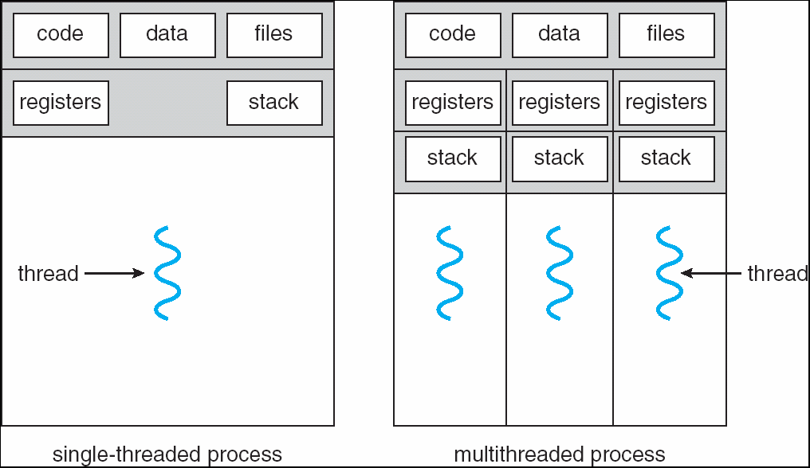

# CONCEPT OF SINGLE THREAD AND MULTITHREAD
### 

Konsep Single Thread dan Multithread  

> Dalam pemrograman komputer, pendekatan *single-threading* berarti semua tugas dalam suatu aplikasi dieksekusi secara berurutan dalam satu alur tunggal. Metode ini menawarkan kesederhanaan dalam perancangan dan pengelolaan kode karena alurnya lurus dan mudah diprediksi. Namun, kekurangannya adalah jika ada satu tugas yang memakan waktu lama atau harus menunggu (misalnya menunggu data dari jaringan), seluruh aplikasi akan berhenti merespons hingga tugas tersebut selesai. Hal ini membuat aplikasi *single-threaded* kurang efisien untuk pekerjaan berat atau yang membutuhkan responsivitas tinggi, karena hanya satu hal yang bisa dikerjakan pada satu waktu.   
Sebaliknya, *multithreading* memungkinkan aplikasi untuk memecah pekerjaannya menjadi beberapa alur (*thread*) yang dapat berjalan secara bersamaan atau paralel (pada prosesor *multi-core*). Ini secara signifikan meningkatkan kinerja dan responsivitas, karena tugas-tugas berat atau yang melibatkan waktu tunggu dapat dijalankan di latar belakang tanpa membekukan antarmuka pengguna. Aplikasi menjadi lebih efisien dalam memanfaatkan sumber daya prosesor. Meskipun kuat, *multithreading* memperkenalkan kompleksitas yang lebih tinggi, seperti perlunya mengelola akses bersama ke data (sinkronisasi) untuk menghindari masalah seperti *race condition* atau *deadlock*, serta membuat proses *debugging* menjadi lebih menantang.

